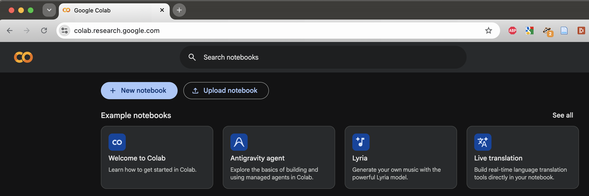
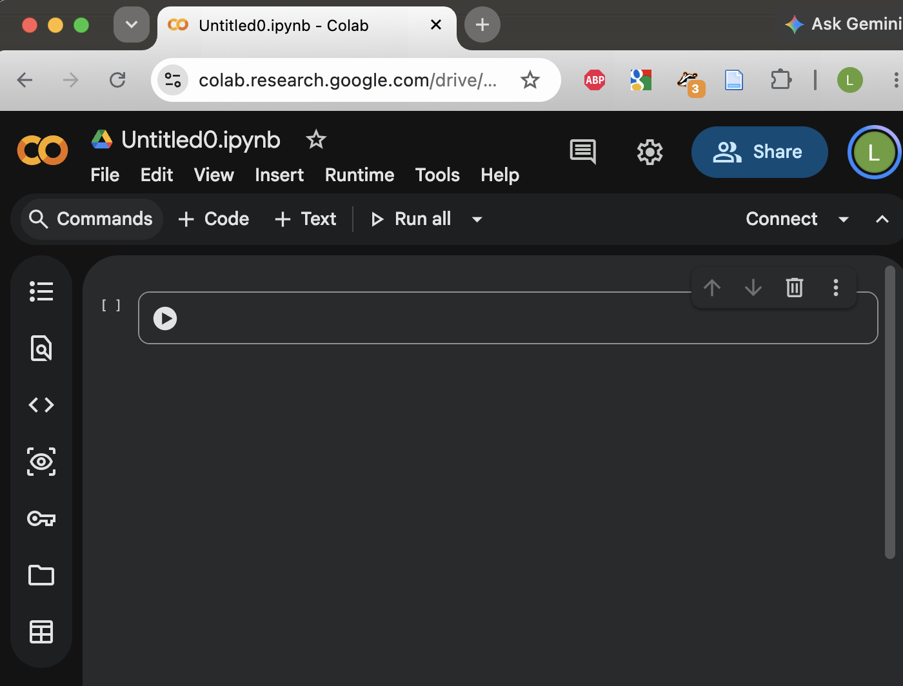
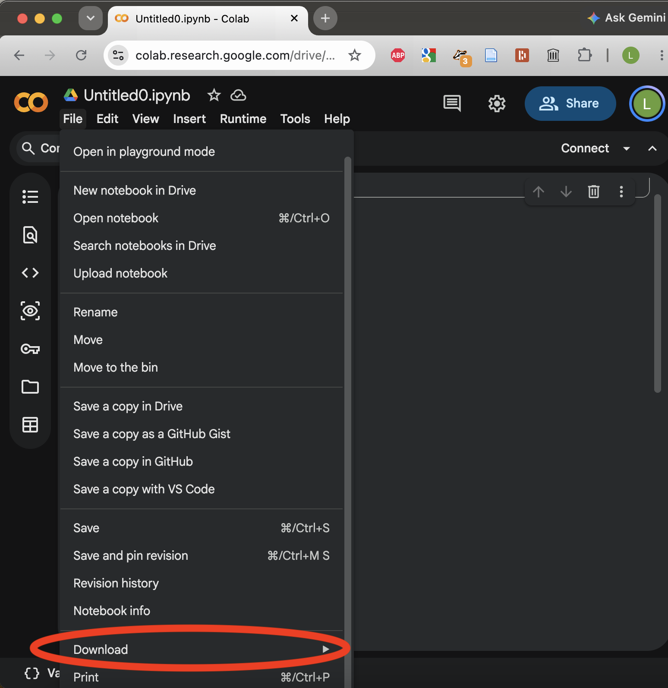
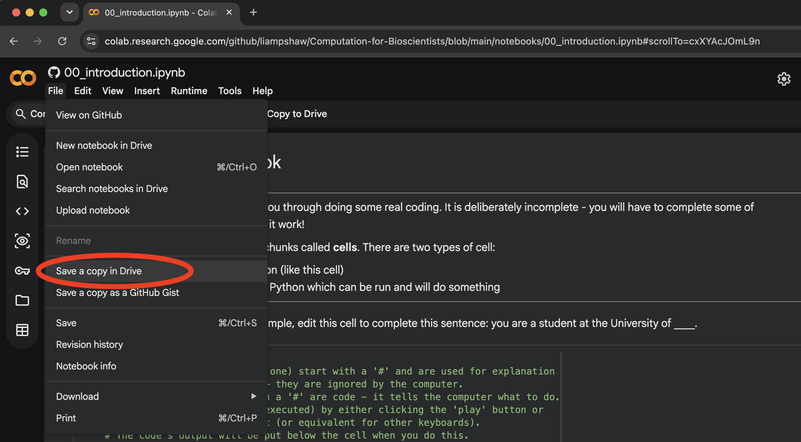

# Computation for Bioscientists
Resource for bioinformatics block of Bristol teaching unit.

### Getting started

N.B. Setup details borrowed from [here](https://bristol-training.github.io/data-analysis-python-1/pages/00_setup.html).

Jupyter Notebooks are interactive documents that allow you to combine executable Python code, text, visuals, and equations in a single place. They run code in small, editable “cells,” making it easy to experiment, get immediate feedback, and document your reasoning as you go.     This format is especially useful for learning and teaching, as it supports step‑by‑step exploration and clear explanations alongside the code.

There are two options as to how to use notebooks. Option 1 is to use Google Colab. This is the recommended option as you don't need to install anything on your computer. Option 2 is to install Python on your computer (see below). 

## Option 1 — Google Colab (recommended)

Google Colab is a free cloud‑based platform that lets you write and run Python code directly in your web browser. **It requires a Google account to use.** Colab provides an environment that can be used to interact with Jupyter Notebooks, but without the need to install Python or any additional software on your computer. This makes it an ideal starting point for doing coding without any installation on your own computer. 

If you want to use Google Colab, you can go to [https://colab.research.google.com/](https://colab.research.google.com/) and (once signed in to a Google account) the page should look something like this:

 

You can click "+ New notebook" to start a new notebook, or "Upload notebook" to open/upload an existing notebook.

### Starting a new notebook

If you click "+ New notebook" it should load a new notebook which looks something like this:



By default, this notebook will be saved in the Google Drive of the Google account you are signed into. You can change the filename to something more useful than `Untitled0.ipynb` by clicking on the filename in the top left and editing it.  

If you want to download the notebook - for example, to save it to your own computer - you can do this by clicking "File". 



As the course goes on, you will be able to save the notebooks to your Google Drive and access previous notebooks. 

### Opening existing notebooks

Once you have some notebooks saved in your Drive, you should see them on your start page when you open [https://colab.research.google.com/](https://colab.research.google.com/). You can also open a notebook by clicking "Upload notebook" and then choosing from the options there.
 
Another way to open an existing notebook is by using a url. For example, the following link should open the first notebook from the course: [first notebook](https://colab.research.google.com/github/liampshaw/Computation-for-Bioscientists/blob/main/notebooks/00_introduction.ipynb). You can then save a copy of this notebook to your Google Drive:



**For instructors:** To link a notebook stored on github to Colab, you need to give the link to the 'raw' content. The link will be something like `https://colab.research.google.com/github/USERNAME/REPO/blob/main/path/to/notebook.ipynb`. 


## Option 2 — Jupyter notebooks on your laptop (via ```uv```)

In this option, you will be running the code on your own computer. You will still access it via your web browser, but this means you need to install a few things to make it work first. The first step is to install a package manager called ```uv``` (software that will help us install the other things we need). How you do this depends on whether you have a Windows or Mac/Linux computer. 

#### Installation on Windows

Open your Command Prompt and run:
```
powershell -ExecutionPolicy ByPass -c "irm https://astral.sh/uv/install.ps1 | iex"
```

#### Installation on Mac/Linux 

Open Terminal and run:
```
curl -Ls https://astral.sh/uv/install.sh | bash
```

#### Next installation steps
Check that the installation of ```uv``` worked by typing ```uv --version```, then pressing enter. You may need to restart your terminal for the changes to take effect. If this returns an error, then ```uv``` was not installed properly.

**Move into Project Directory**

To set up your Python environment, you need to be in your project directory. Follow these steps:

1. Open your terminal.
2. Create or navigate to your project directory.

**Create a Virtual Environment**

Enter the following command to create a minimal virtual environment:
```
uv init --bare
```

**Install Python packages**

We will need ```jupyterlab``` to edit the notebooks. This can be added to your project with the command:
```
uv add jupyterlab
```


**Open JupyterLab**

Now you can open JupyerLab
```
uv run jupyter lab
```

This should open a page in your browser that looks something like this:


In JupyterLab, you should be able to open the first notebook of the course by clicking File -> Open from URL... and then pasting the following url: ```https://raw.githubusercontent.com/liampshaw/Computation-for-Bioscientists/main/notebooks/00_introduction.ipynb```. Alternatively, you can download the notebook file to your computer, save it, and then open the version on your computer. You can also open a new notebook and start to do your own work and save files.
